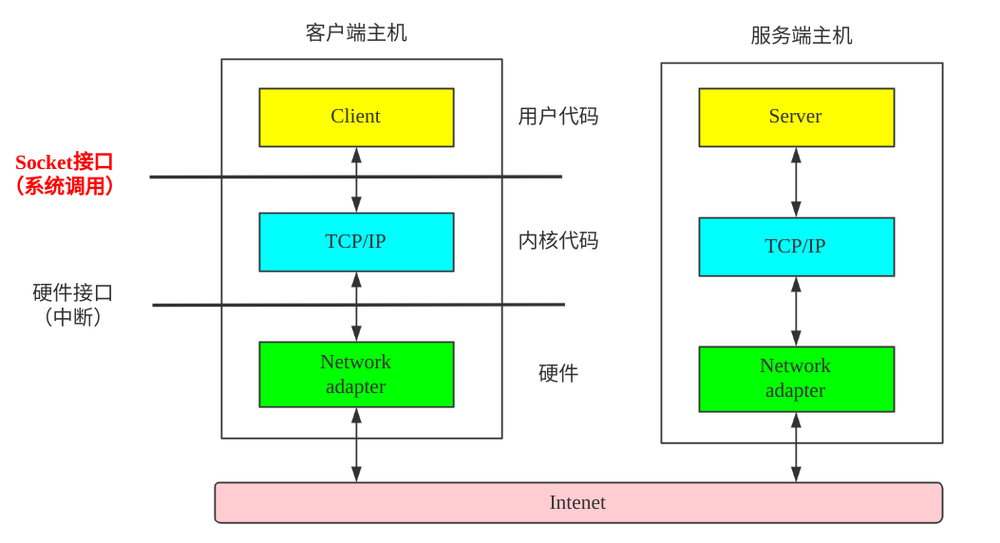

# 对Socket和SO_REUSEPORT选项的理解

> - socket连接过程
> - file descriptor含义
> - socket与网络库关系 Socket编程
> - FIN与Socket的关系
> - select POLL epoll
> - SO_RESEPORT原理
> - NIO  IO
> - 

# 一、Socket连接过程

## 1.1 Socket API

列举几个主要的API：

- `socket()`：创建一个用于通信的终端（endpoint），并返回一个指向该终端的文件描述符（file descriptor, 简称fd）。如果函数调用成功，返回的是没有被进程打开的序号最小的文件描述符。
  - **什么是文件描述符**：在Linux中一切都可看做是文件，比如：普通文件、目录、链接、设备。文件描述符是内核管理被打开的文件所创建的索引，是个非负整数，用来指代被打开的文件，所有执行I/O操作的系统调用都是通过文件描述符完成。举个例子：程序刚启动的时候，0是标准输出，1是标准错误，如果此时打开一个新的文件，那么他的文件描述符就是3；
  - **文件描述符限制**：内核会限制一个进程最大的文件打开数，`ulimit -n`命令可以查，一般是1024。（`too many open files`错误就是提示打开的文件数超过限制了）；
  - **函数签名**：`int socket(int domain, int type, int protocol)`
    - `domain`：通信使用的域，是一组通信协议组（protocol family），常用的是`AF_INET`（IPv4互联网协议）和`AF_INET6`（IPv6）；
    - `type`：通信的语义，常用的是`SOCK_STREAM`（字节流传输，用于TCP）和`SOCK_DGRM`（数据报-datagram传输，用于UDP）；
    - `protocol`：指定Socket使用的协议，如果设置0，则表示使用协议组中的协议，具体哪个根据`type`参数来定，也可以手动指定其他的协议。一般使用0；
    - 返回值：文件描述符
- `bind`：绑定
- `listen`
- `accept`
- `recv`
- `recvfrom`
- `send`
- `sendto`
- `connect`

## 1.2 TCP Socket

## 1.3 UDP Socket

## 1.4 FD

